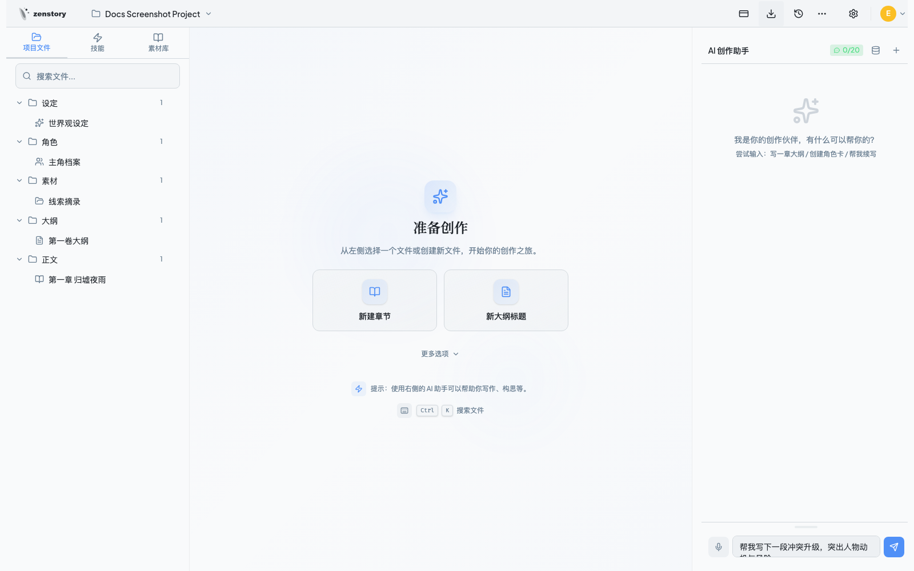
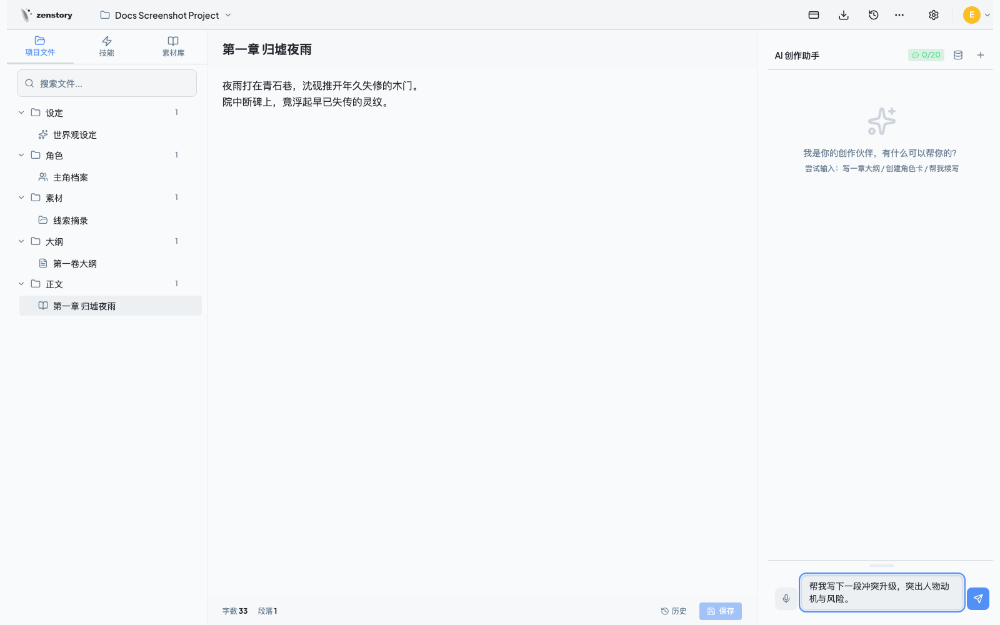
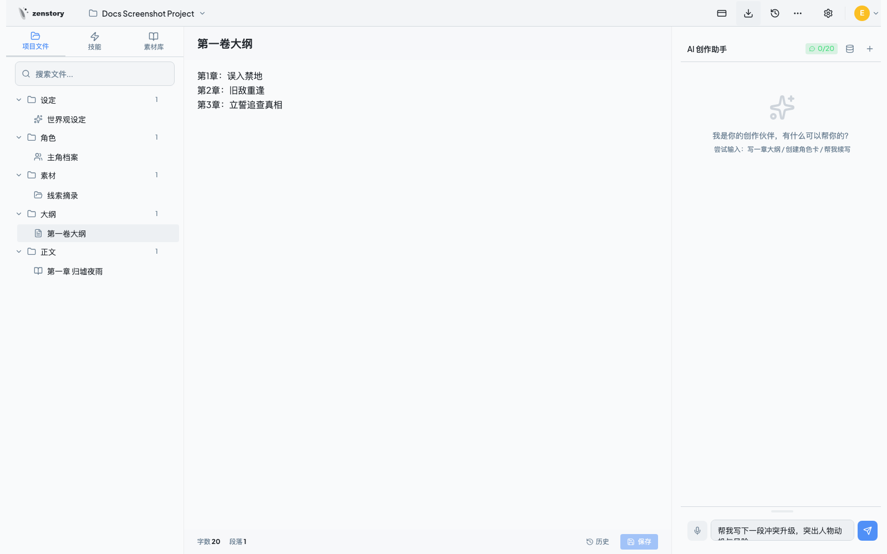
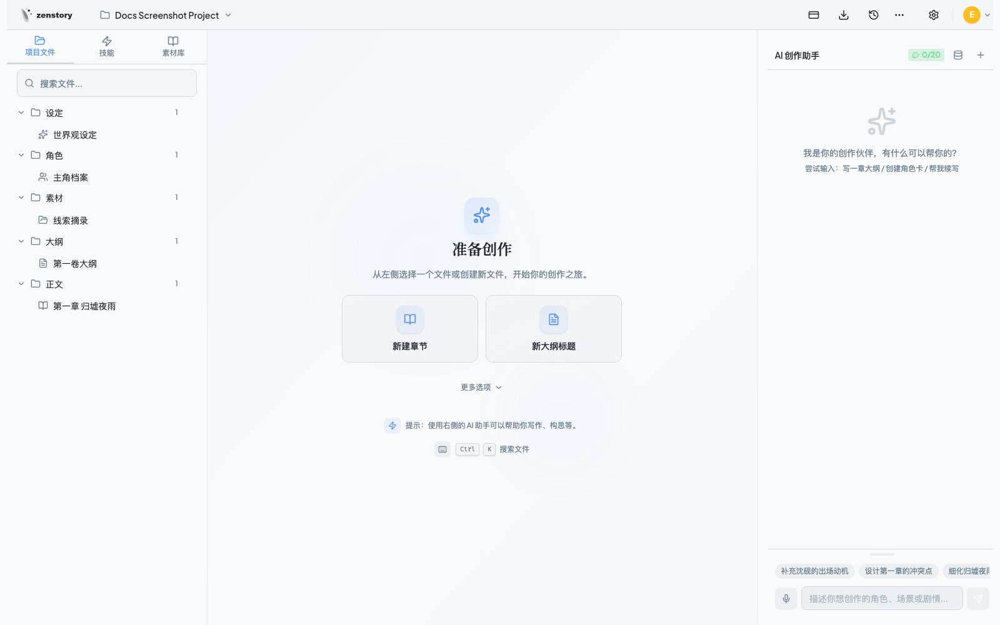
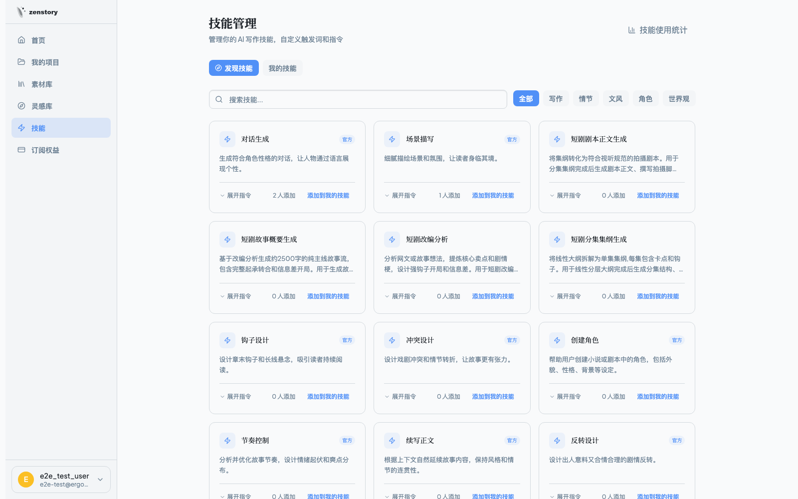
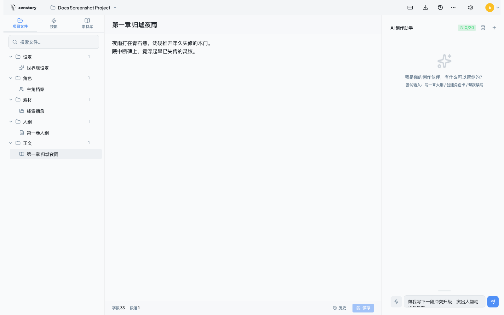
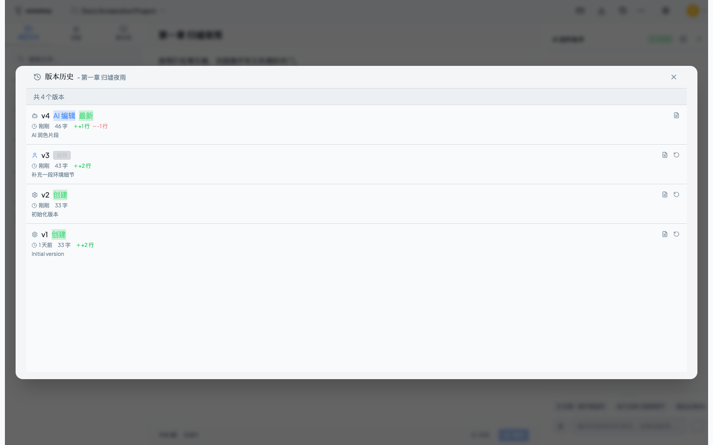

<div align="center">


# ZenStory

**Where Conversation Meets Creation — The AI Agent-Powered Commercial Writing Workbench**

[](LICENSE)
[](https://github.com/worldwonderer/zenstory)
[](https://zenstory.ai/)


**2,000+ Creators &middot; 12M Words Generated &middot; 4.9 Rating**

ZenStory's Agent directly operates your file system — creating character cards, decomposing reference materials, planning outlines, and writing chapter by chapter — all within a conversation.

**[zenstory.ai](https://zenstory.ai/)** &middot; [Quick Start](#quick-start) &middot; [中文文档](README.md)

</div>

---

<table>
  <tr>
    <td></td>
  </tr>
  <tr>
    <td align="center"><b>Three-Panel Workspace — File Tree &middot; Editor &middot; AI Chat — the Agent reads and writes your files directly</b></td>
  </tr>
</table>

---

## Why ZenStory?

| Traditional AI Writing Tools | ZenStory |
|:---|:---|
| Chat box + copy-paste | Agent creates, edits, and organizes files directly |
| No context memory, starting from scratch every time | Understands character relationships and world-building rules |
| Single AI model | Five specialized agents collaborating (Planner → Writer → Reviewer) |
| Stuck when inspiration runs dry | AI decomposes reference works + generates inspiration cards |
| No integration with external tools | Agent API supports Claude Code / OpenClaw direct connection |

---

## Core Highlights

### 1. Conversation x File System = A New Creative Paradigm

The AI doesn't stay in the chat box — it operates your creative files through a complete tool chain:

<table>
  <tr>
    <td align="center"><b>AI Chat-Driven Creation</b></td>
    <td align="center"><b>Intelligent File Tree</b></td>
  </tr>
  <tr>
    <td></td>
    <td></td>
  </tr>
</table>

- **Conversational file operations** — "Create a villain with a dark personality and a tragic past" — the Agent creates a character card and fills in the details
- **Context-aware** — The AI understands character relationships, world-building rules, and existing chapters — no continuity errors
- **Diff review mode** — AI changes shown as inline diffs, apply only after your approval — you stay in control
- **Streaming generation** — Watch the AI write in real-time, intervene and adjust at any moment
- **Complete tool chain** — 9 tools covering file creation, editing, content search, project updates, and more

### 2. Five-Agent Collaborative Writing Engine

Five specialized agents with clear roles, forming a complete AI writing team:

```
┌─────────┐    ┌─────────┐    ┌──────────┐    ┌─────────┐    ┌──────────────────┐
│ Router  │───►│ Planner │───►│  Hook    │───►│ Writer  │───►│ Quality Reviewer │
│ Intent  │    │ Story   │    │ Designer │    │ Content │    │  Consistency &   │
│ Routing │    │ Planner │    │ Twists   │    │ Creator │    │  Quality Gate    │
└─────────┘    └─────────┘    └──────────┘    └─────────┘    └──────────────────┘
```

| Agent | Role | When It Activates |
|-------|------|------------------|
| **Router** | Intent classification, optimal workflow selection | Every request |
| **Planner** | Story structure, chapter pacing | Complex creative tasks |
| **Hook Designer** | Plot twists, suspense, climaxes | When engagement needs a boost |
| **Writer** | Content creation with adaptive style | All creative tasks |
| **Quality Reviewer** | Consistency checking, quality assurance | Auto-triggered for long content |

Four intelligent workflows — Quick Write, Standard, Full Collaboration, and Hook Focus — the Router automatically assesses task complexity and routes to the optimal path. Agents support intelligent handoffs for true multi-round collaboration.

### 3. Material Library: AI-Powered Reference Decomposition

Upload reference novels you admire, and the AI automatically decomposes them into **8 categories of structured creative elements**:

| Dimension | Description |
|-----------|-------------|
| **Chapter Summaries** | Core events and plot progression per chapter |
| **Character Profiles** | Names, aliases, archetypes, ability systems |
| **Character Relationships** | Complex relationship networks |
| **Plot Points** | 10-15 key events per chapter (conflict/turning point/reveal/dialogue) |
| **Story Arcs** | Cross-chapter aggregated plot arcs (setup-development-climax-resolution) |
| **World Building** | Power systems, world structure, key factions |
| **Golden Fingers** | Special abilities — name, type, evolution history |
| **Event Timeline** | Chronological ordering of all events |

Decomposed materials are searchable via **Hybrid RAG** — dual-engine keyword + semantic vector search for pinpoint accuracy. The AI automatically references relevant materials during writing to maintain style and setting consistency.

### 4. Inspiration Library: Break Through Writer's Block

<table>
  <tr>
    <td></td>
  </tr>
  <tr>
    <td align="center"><b>Context-aware inspiration cards — copy to project and start writing instantly</b></td>
  </tr>
</table>

- **Context-aware** — Generates precise inspirations based on your project type (novel/short/screenplay) and existing content
- **Featured picks** — Editor-curated high-quality inspiration templates covering all creative scenarios
- **One-click reuse** — Copy inspirations directly to your project and start creating immediately
- **Material synergy** — The richer your material library, the more precise the inspiration recommendations

### 5. Skills System & Marketplace

13+ built-in professional writing skills, ready to use:

| Category | Skills |
|----------|--------|
| **Writing** | Continue Writing &middot; Scene Description &middot; Dialogue Generation &middot; Opening Creation |
| **Plot** | Conflict Design &middot; Suspense Design &middot; Reversal Design &middot; Rhythm Control |
| **Style** | Immersion Enhancement &middot; Text Polishing |
| **Setup** | Character Creation &middot; Outline Generation &middot; World Building |

<table>
  <tr>
    <td></td>
  </tr>
  <tr>
    <td align="center"><b>Skills Marketplace — Markdown-defined skills, one-click sharing, community-driven</b></td>
  </tr>
</table>

Support custom skill creation with Markdown format, one-click sharing to the marketplace. Admin moderation and community contributions make it grow stronger with use.

### 6. Agent API — Connect Your AI Tools to Your Writing Workspace

Generate an API key, paste it into Claude Code or OpenClaw, and let external AI agents directly read and write your novel projects:

```bash
# In Claude Code or OpenClaw, the agent can:
# - Read project files and character settings
# - Create new chapters and characters
# - Search the material library
# - Edit existing content
```

This isn't just "AI-assisted writing" — it's **AI ecosystem interconnection**. Any AI tool you love can become a ZenStory creative engine.

### 7. Professional Writing Workbench

<table>
  <tr>
    <td align="center"><b>Tiptap Rich Text Editor</b></td>
    <td align="center"><b>Version Comparison & Rollback</b></td>
  </tr>
  <tr>
    <td></td>
    <td></td>
  </tr>
</table>

- **Six file types** — Outline, Draft, Script, Character, Lore, Snippet — each with a specialized editing interface
- **Smart sorting** — Auto-detects Chinese and Arabic chapter numbers ("第一章" / "Chapter 1"), orders accordingly
- **Version snapshots** — Auto-save on every edit, one-click diff comparison between any two versions, rollback support
- **Project-level snapshots** — A time machine for your entire project, return to any creative checkpoint
- **Multi-format export** — One-click export to Word / Markdown / Plain Text, chapters auto-merged in order
- **Voice input** — Speech-to-text, long-press recording, mobile-friendly
- **Global search** — Cmd+K to quickly search across all project files
- **Dark mode** — Eye-friendly writing, follows system preference
- **Bilingual** — Full i18n support for English and Chinese interfaces

### 8. Commercial-Grade Features

ZenStory is a complete commercial product:

- **Subscription tiers** — Free / Pro / Max plans, choose by creative task
- **Quota management** — Fine-grained control over word count, agent tasks, project count, material uploads
- **Points system** — Daily check-in, referral rewards, redemption codes
- **Writing streak** — Track daily writing, streak protection, freeze mechanism
- **Analytics** — Word count trends, chapter completion, AI collaboration metrics, project health
- **Admin dashboard** — User management, subscription management, skill review, prompt editing, data dashboards
- **Project types** — Novel, Short Story, Screenplay — each with dedicated creative guidance

---

---

## Quick Start

### Prerequisites

- Node.js >= 18
- Python >= 3.12
- pnpm

### Option 1: Docker Compose (Recommended)

One API key, one command:

```bash
export DEEPSEEK_API_KEY=your-key
docker compose up -d --build
```

Open:
- Frontend: http://localhost:5173
- API Docs: http://localhost:8000/docs

> Data persists in Docker volumes. Works with SQLite out of the box.

### Option 2: Local Development

```bash
# 1. Backend
cd apps/server
python3 -m venv venv && source venv/bin/activate
pip install -r requirements.txt
cp .env.example .env          # Edit .env to add your API key
python3 main.py

# 2. Frontend (new terminal)
cd apps/web
pnpm install
cp .env.example .env.local
pnpm dev
```

> Only one LLM API key needed (supports DeepSeek / Anthropic). For production deployment (PostgreSQL + Redis), see [docs/docker-compose.md](docs/docker-compose.md).

---

## Project Architecture

```
zenstory/
├── apps/
│   ├── web/                    # React Frontend
│   │   ├── src/components/     # Components (Layout/FileTree/Editor/ChatPanel/Skills/...)
│   │   ├── src/hooks/          # Hooks (useAgentStream/useVoiceInput/useMaterialLibrary/...)
│   │   ├── src/contexts/       # Contexts (Auth/Project/Theme)
│   │   └── src/pages/          # Pages (Dashboard/Project/Billing/Materials/...)
│   └── server/                 # FastAPI Backend
│       ├── api/                # API routes (auth/projects/files/agent/chat/export/voice)
│       ├── agent/              # AI Agent System ★
│       │   ├── graph/          #   LangGraph multi-agent workflow
│       │   ├── tools/          #   9 agent tools (create_file/edit_file/hybrid_search/...)
│       │   ├── context/        #   Context assembly + token budget management
│       │   ├── prompts/        #   Project-type prompts + agent-specific prompts
│       │   └── skills/         #   Skill loading/matching/injection
│       ├── models/             # Data models (File/Material/Subscription/Skill/...)
│       ├── services/           # Business logic layer
│       │   ├── material/       #   Material decomposition (16 sub-modules)
│       │   └── features/       #   Export/snapshot/verification services
│       └── config/             # Configuration (Logger/Settings/AgentRuntime)
└── docs/                       # Documentation and screenshots
```

---

## Roadmap

- [x] Multi-Agent collaborative writing engine (Router/Planner/Writer/QualityReviewer/HookDesigner)
- [x] Material library with AI decomposition (8 structured element types + hybrid RAG)
- [x] Inspiration library (context-aware + one-click reuse)
- [x] Skills system & marketplace (13+ built-in + custom + community sharing)
- [x] Agent API (Claude Code / OpenClaw direct connection)
- [x] Version snapshots & diff comparison
- [x] Voice input
- [x] Commercial features (subscriptions/quotas/points/admin dashboard)
- [ ] Native mobile app

---

## Contributing

Contributions are welcome!

- [Report a Bug](https://github.com/worldwonderer/zenstory/issues/new?template=bug_report.md)
- [Request a Feature](https://github.com/worldwonderer/zenstory/issues/new?template=feature_request.md)
- Submit a Pull Request

Please read [CONTRIBUTING.md](CONTRIBUTING.md) for guidelines.

## License

[MIT License](LICENSE) &copy; 2024-2026 ZenStory
